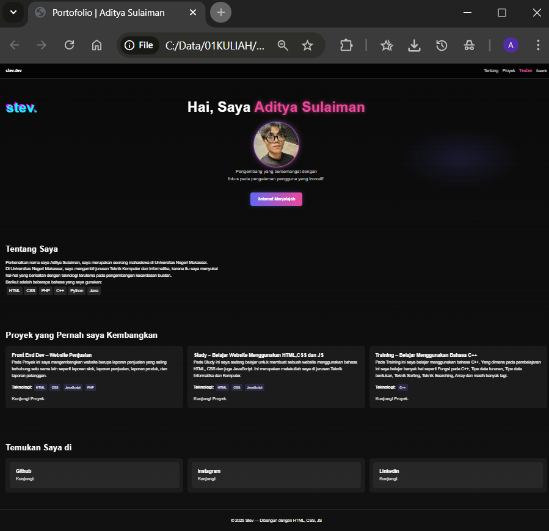

# Membuat Portofolio
Pada kali ini saya ingin membuat portofolio sebagai tugas dalam mata kuliah Pemrograman Web. Kali ini saya diperintahkan untuk membuat sebuah portofolio di sebuah website menggunakan HTML dan CSS yang berisi data diri saya.
Dapat dilihat pada folder Portopolio terdapat 3 file yaitu index.html, style.css, dan README.md. File index.html berisi kode HTML untuk membuat struktur halaman web, sedangkan file style.css berisi kode CSS untuk mengatur tata letak dan gaya halaman web.

# File index.html
File index.html merupakan file utama yang berisi kode HTML untuk membuat struktur halaman web. File ini terdiri dari beberapa bagian seperti head, body, dan beberapa tag HTML lainnya. Di dalam file ini, saya mengatur judul halaman, menambahkan link ke file CSS, dan membuat struktur halaman web dengan menggunakan tag-tag HTML seperti div, h1, p, dan img.

# File style.css
File style.css merupakan file yang berisi kode CSS untuk mengatur tata letak dan gaya halaman web. File ini terdiri dari beberapa bagian seperti selector, property, dan value. Di dalam file ini, saya mengatur gaya halaman web seperti warna, font, ukuran, dan tata letak.

# File script.js
File script.js merupakan file yang berisi kode JavaScript untuk membuat interaktivitas pada halaman web. File ini terdiri dari beberapa bagian seperti function, variable, dan event. Di dalam file ini, saya membuat fungsi-fungsi JavaScript untuk membuat halaman web lebih interaktif seperti menghighlight icon saat terkena kursor.

# Penjelasan indeks
<h3>Navigation Bar</h3>

pada navigation bar ini saya menggunakan class pada css untuk mengatur tata letak dan gaya halaman web yaitu class="navbar" yang didalamnya terdapat class lain seperti "logo" dan "nav-link"

html:
```html   
<nav class="navbar">
    <div class="logo">stev.dev</div>
    <ul class="nav-links">
      <li><a href="#about" class="nav-link">Tentang</a></li>
      <li><a href="#projects" class="nav-link">Proyek</a></li>
      <li><a href="#links" class="nav-link">Tautan</a></li>
      <li><button id="open-cmd">Search</button></li>
    </ul>
  </nav>
  ```
  css:
```css
 .navbar {
  position: sticky; top: 0; z-index: 10;
  display: flex; justify-content: space-between; align-items: center;
  padding: 1rem 2rem;
  background: rgba(0,0,0,0.6); backdrop-filter: blur(8px);
  border-bottom: 1px solid rgba(255,255,255,0.1);
}
.navbar .logo { font-weight: bold; }
.nav-links { list-style: none; display: flex; gap: 1rem; }
.nav-links a, .nav-links button {
  color: #ccc; background: none; border: none; cursor: pointer;
  text-decoration: none;
  transition: color 0.3s;
}
.nav-links a:hover, .nav-links button:hover { color: #fff; }
.nav-links a.active { color: #ec4899; font-weight: bold; }
```
Di sini saya membuat navbar atau menu navigasi di atas halaman. Di bagian HTML, saya pakai nav class="navbar" sebagai wadahnya. Di dalamnya ada div class="logo" stev.dev /div untuk menampilkan nama/logo di sebelah kiri, lalu ada ul class="nav-links" yang isinya beberapa menu di sebelah kanan, yaitu "Tentang", "Proyek", "Tautan", dan juga tombol "Search".

Bagian CSS dipakai untuk mengatur tampilannya. Saya buat navbar ini menempel di atas meskipun halaman digulir, pakai position: sticky; top: 0;. Tata letaknya diatur dengan flexbox supaya logo rata kiri dan menu rata kanan. Latar belakangnya saya kasih warna hitam transparan dengan efek blur, jadi kelihatan modern. Di bawah navbar ada garis tipis biar rapi.

Menu navigasi ditampilkan horizontal tanpa tanda titik (bullet list) dan ada jarak antar menu. Warna tulisan awalnya abu-abu, lalu kalau diarahkan pakai mouse (hover) berubah jadi putih. Kalau link dalam keadaan aktif, warnanya jadi pink (#ec4899) dan tulisannya lebih tebal.

Hasilnya, navbar ini kelihatan sederhana, modern, dan gampang dipakai, dengan logo di kiri serta menu navigasi + tombol search di kanan.

<hr>
<h3>Body</h3>

Pada bagian ini saya menggunakan header dengan class="hero" yang didalamnya itu terdapat perintah css yang sudah mengatur beberapa hal seperti header, tombol jelajah, dan tulisan paragraf.

html:
```html
   <header class="hero">   
    <h1 class="glitch" data-text="stev.">Hai, Saya <span>Aditya Sulaiman</span></h1>
     
    <p>Pengembang yang bersemangat dengan<br>fokus pada pengalaman pengguna yang inovatif.</p>
    <div class="hero-buttons">
      <a href="#about" class="btn primary">Selamat Menjelajah</a>
    </div>
  </header>
```
css:
```css
.hero { padding: 5rem 2rem; text-align: center; }
.hero h1 { 
    font-size: 3.5rem; 
    margin-bottom: 1.5rem; 
    position: relative;
    line-height: 1.2; 
}
.hero h1 span { 
    color: #ec4899; 
    text-shadow: 0 0 10px rgba(236, 72, 153, 0.5), 0 0 20px rgba(236, 72, 153, 0.3);
}
.hero p { max-width: 600px; margin: 0 auto 2.5rem; color: #ccc; font-size: 1.1rem; } 
```
Bagian ini adalah header hero atau tampilan utama website yang biasanya langsung terlihat saat halaman dibuka. Di dalamnya ada judul besar "Hai, Saya Aditya Sulaiman" di mana nama saya diberi tag span supaya bisa dikasih efek warna berbeda. Setelah itu ada foto profil saya dengan ukuran 200x200 piksel yang diberi class tambahan profil-img neon-border agar tampilannya lebih menarik. Lalu ada paragraf singkat yang menggambarkan diri saya sebagai pengembang dengan fokus pada pengalaman pengguna yang inovatif. Di bawahnya saya tambahkan tombol bergaya link "Selamat Menjelajah" yang akan membawa pengunjung ke bagian "Tentang Saya".

Pada CSS, class hero saya atur dengan padding besar dan teks rata tengah supaya semua elemen terlihat seimbang di layar. Judul h1 diberi ukuran font besar (3.5rem), jarak bawah 1.5rem, dan line-height 1.2 agar teks tidak terlalu rapat. Untuk bagian span di dalam judul, warnanya dibuat pink (#ec4899) dan diberi efek glow dengan text-shadow sehingga nama saya lebih menonjol. Paragraf diatur agar lebarnya maksimal 600px supaya teks tetap rapi di layar lebar, diberi margin auto biar posisinya tetap di tengah, warna teks abu-abu terang, dan ukuran font 1.1rem agar mudah dibaca.

<hr>
<h3>Section Tentang Saya</h3>

Pada bagian ini menjelaskan sedikit tentang diri saya. Pada bagian ini saya menggunakan id="about" yang didalamnya terdapat class "reveal" yang sudah mengatur h2 dan tulisan dibawahnya, dilanjutkan dengan span-span dibawahnya yang menggunakan class "skills" yang telah mengatur posisi, ukuran serta warnanya.

html:
```html
   <section id="about" class="reveal">
    <h2>Tentang Saya</h2>
    <p>Perkenalkan nama saya Aditya Sulaiman, saya merupakan seorang mahasiswa di Universitas Negeri Makassar.</p>
    <p>Di Universitas Negeri Makassar, saya mengambil jurusan Teknik Komputer dan Informatika, karena itu saya menyukai<br>
      hal-hal yang berkaitan dengan teknologi terutama pada pengembangan kecerdasan buatan.<br>
      Berikut adalah beberapa bahasa yang saya gunakan:
    </p>
    <div class="skills">
      <span>HTML</span><span>CSS</span><span>PHP</span><span>C++</span><span>Python</span><span>Java</span>
    </div>
  </section>
```

css reveal:
```css
.reveal {
  opacity: 0;
  transform: translateY(30px);
  transition: opacity 0.8s ease-out, transform 0.8s ease-out;
}
.reveal.visible {
  opacity: 1;
  transform: translateY(0);
}
}
```

css skills"
```css
.skills span {
  display: inline-block;
  margin: 0.2rem;
  padding: 0.3rem 0.6rem;
  background: rgba(255,255,255,0.1);
  border-radius: 4px;
}
```

Bagian ini adalah section "Tentang Saya" pada halaman web. Di HTML, saya membuat sebuah section dengan id about dan class reveal supaya isinya bisa diberi efek animasi saat muncul. Di dalamnya ada judul "Tentang Saya", lalu beberapa paragraf berisi perkenalan diri sebagai mahasiswa Universitas Negeri Makassar jurusan Teknik Komputer dan Informatika. Setelah itu saya menampilkan daftar bahasa pemrograman yang saya kuasai menggunakan sebuah div dengan class skills, di mana setiap bahasa ditulis menggunakan span, seperti HTML, CSS, PHP, C++, Python, dan Java.

Di CSS, saya menambahkan efek animasi untuk class reveal. Awalnya elemen ini diset transparan dan agak turun ke bawah dengan opacity 0 dan transform translateY(30px). Lalu ketika elemen diberi class tambahan visible, tampilannya berubah menjadi jelas dan berada di posisi normal dengan opacity 1 dan transform translateY(0). Perubahan ini dibuat halus dengan transisi selama 0.8 detik.

Untuk daftar bahasa di dalam class skills, setiap span ditampilkan seperti kotak kecil. Saya atur dengan display inline-block, diberi jarak menggunakan margin, padding supaya ada ruang dalam, latar belakang transparan tipis, dan sudutnya dibuat sedikit membulat dengan border-radius 4px. Jadi hasilnya bahasa pemrograman terlihat rapi seperti label atau badge.
        
<hr>
<h3>Section Proyek</h3>

Pada bagian ini masih sama menggunakan class "reveal" tapi pada ketiga kotak tersebut menggunakan class "project-list" dan class "project-card" yang mengatur posisi dan lain-lainnya pada kotak tersebut. Pada kotak tersebut terdapat tulisan "Kunjungi Poryek." pada bagian tersebut saya memasukkan href yang berisi link proyek yang telah saya masukkan di github, pada bagian ini juga saya menggunakan beberapa perintah JS untuk menghighlight kotak ketika kursor mengarah ke salahsatu kotak(dapat dilihat pada warna kotak yang berbeda sendiri).

html:
```html
<section id="projects" class="reveal">
    <h2>Proyek yang Pernah saya Kembangkan</h2>
    <div class="project-list">
      <div class="project-card">
        <h3>Front End Dev – Website Penjualan</h3>
        <p>Pada Proyek ini saya mengembangkan website berupa laporan penjualan yang saling terhubung satu sama lain
          seperti laporan stok, laporan penjualan, laporan produk, dan laporan pelanggan.
        </p>
        <div class="tech-stack">
            <strong>Teknologi:</strong> <span>HTML</span> <span>CSS</span> <span>JavaScript</span> <span>PHP</span>
        </div>
        <a href="https://github.com/styevw/website-penjualan" target="_blank" class="project-link">Kunjungi Proyek.</a>
      </div>
      <div class="project-card">
        <h3>Study – Belajar Website Menggunakan HTML,CSS dan JS</h3>
        <p>Pada Study ini saya sedang belajar untuk membuat sebuah website menggunakan bahasa HTML, CSS dan juga JavaScript.
          Ini merupakan matakuliah saya di jurusan Teknik Informatika dan Komputer.
        </p>
        <div class="tech-stack">
            <strong>Teknologi:</strong> <span>HTML</span> <span>CSS</span> <span>JavaScript</span>
        </div>
        <a href="https://github.com/styevw/Kuliah-Pemrograman-Web" target="_blank" class="project-link">Kunjungi Proyek.</a>
      </div>
      <div class="project-card">
        <h3>Training – Belajar Menggunakan Bahasa C++</h3>
        <p>Pada Training ini saya belajar menggunakan bahasa C++. Yang dimana pada pembelajaran ini saya belajar banyak hal
          seperti Fungsi pada C++, Tipe data turunan, Tipe data bentukan, Teknik Sorting, Teknik Searching, Array dan masih banyak
          lagi.
        </p>
        <div class="tech-stack">
            <strong>Teknologi:</strong> <span>C++</span>
        </div>
         <a href="https://github.com/styevw/CPP" target="_blank" class="project-link">Kunjungi Proyek.</a>
      </div>
    </div>
  </section>
```

css project list, link, dan card:
```css
.project-list { display: grid; gap: 1rem; grid-template-columns: repeat(auto-fit,minmax(250px,1fr)); }
.project-card {
  background: rgba(255,255,255,0.05);
  padding: 1.5rem;
  border-radius: 12px;
  transition: background 0.3s, transform 0.3s;
  display: flex;
  flex-direction: column;
}
.project-card:hover { 
    background: rgba(236,72,153,0.15); 
    transform: translateY(-5px);
}
.project-card p { flex-grow: 1; }
.tech-stack { margin: 1rem 0; }
.tech-stack span {
    display: inline-block;
    font-size: 0.8rem;
    margin: 0.2rem;
    padding: 0.2rem 0.5rem;
    background: rgba(99,102,241,0.2);
    border-radius: 4px;
}
.project-link {
    color: #ccc;
    text-decoration: none;
    font-weight: bold;
    align-self: flex-start;
}
.project-link:hover { color: #fff; }
```
Bagian ini adalah section proyek yang saya beri id projects dan class reveal agar bisa diberi animasi saat tampil. Di dalamnya ada judul "Proyek yang Pernah saya Kembangkan" lalu sebuah div dengan class project-list yang berisi beberapa card proyek.

Setiap proyek saya simpan di dalam project-card. Di dalam satu card ada judul proyek, penjelasan singkat tentang proyek tersebut, daftar teknologi yang digunakan (ditampilkan dengan tech-stack berisi beberapa span agar terlihat seperti label kecil), serta link menuju repository GitHub proyek tersebut.

Untuk CSS, class project-list saya atur menggunakan grid layout supaya card proyek bisa tersusun rapi dalam beberapa kolom dan otomatis menyesuaikan ukuran layar. Class project-card saya desain dengan latar belakang transparan tipis, diberi padding, sudut membulat (border-radius), dan efek transisi halus. Saat kursor diarahkan ke card, latarnya berubah menjadi sedikit pink transparan dan posisinya naik sedikit ke atas (transform: translateY(-5px)), sehingga terasa interaktif.

Bagian paragraf di dalam card (project-card p) diatur dengan flex-grow: 1 supaya teks bisa memenuhi ruang kosong secara proporsional. Untuk daftar teknologi (tech-stack), setiap span ditampilkan seperti badge kecil dengan ukuran lebih kecil, warna latar biru transparan, dan sudut membulat. Link menuju proyek (project-link) diberi warna abu-abu tebal, tanpa garis bawah, dan saat di-hover warnanya berubah jadi putih agar lebih jelas terlihat.

<hr>
<h3>Section Sosial Media</h3>

Pada bagian ini masih menggunakan class "reveal" tapi bedanya pada kotak kotak tersebut saya menggunakan class "exp-card" dan "project-card" yang mengatur posisi dan lain-lainnya pada kotak tersebut, dilanjutkan dengan tuliasan "Kunjungi." yang didalamnya terdapat href yang sudah berisi link media sosial saya.

html:
```html
<section id="links" class="reveal">
    <h2>Temukan Saya di</h2>
    <div class="experience-list">
      <div class="exp-card">
        <div class="project-card">
        <h3>Github</h3>
        <p><a href="https://github.com/styevw" target="_blank" class="project-link">Kunjungi.</a></p>
        </div>
      </div>
      <div class="exp-card">
        <div class="project-card">
        <h3>Instagram</h3>
       <p><a href="https://www.instagram.com/adxtev/" target="_blank" class="project-link">Kunjungi.</a></p>
       </div>
      </div>
       <div class="exp-card">
        <div class="project-card">
        <h3>Linkedin</h3>
        <p><a href="https://www.linkedin.com/in/aditya-sulaiman-655152324?utm_source=share&utm_campaign=share_via&utm_content=profile&utm_medium=android_app" target="_blank" class="project-link">Kunjungi.</a></p>
      </div> 
      </div>
    </div>
  </section>
  ```
css experience list, exp-card:
```css
.experience-list { display: grid; gap: 1rem; grid-template-columns: repeat(auto-fit,minmax(250px,1fr)); }
.exp-card {
  background: rgba(255,255,255,0.05);
  padding: 1rem;
  border-radius: 12px;
}

```

Bagian ini adalah section "Temukan Saya di". Tujuannya untuk menampilkan link ke beberapa akun media sosial dan platform saya. Di dalamnya ada tiga kartu, masing-masing untuk Github, Instagram, dan Linkedin. Setiap kartu ditulis dalam exp-card yang di dalamnya ada project-card, berisi judul nama platform lalu link dengan tulisan "Kunjungi" yang bisa langsung membuka halaman profil saya di tab baru.

Untuk CSS, class experience-list saya atur menggunakan grid layout supaya kartu-kartu akun bisa ditampilkan sejajar dalam beberapa kolom dan otomatis menyesuaikan ukuran layar. Sementara exp-card saya desain dengan latar belakang transparan tipis (rgba(255,255,255,0.05)), diberi padding supaya kontennya tidak menempel ke tepi, dan sudut membulat (border-radius: 12px) agar terlihat lebih modern dan rapi.

Dengan kombinasi ini, section "Temukan Saya di" menampilkan akun sosial saya dalam bentuk kartu sederhana, rapi, dan responsif, sehingga pengunjung website bisa dengan mudah menemukan dan mengunjungi profil saya di berbagai platform.

<hr>
<h3>Footer</h3>

Pada bagian footer ini saya menambahkan watermark diri sendiri yang memberikan informasi bahwa web ini dibuat dengan bahasa HTML, CSS, dan JS.

html:
```html
<footer>
    <p>© 2025 Stev — Dibangun dengan HTML, CSS, JS</p>
  </footer>
  ```

<hr>
<h3>Tampilan Full Portofolio</h3>
