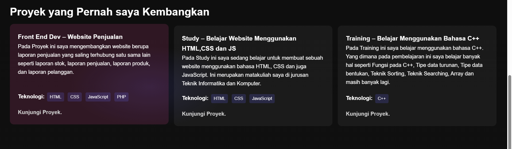

# Membuat Portofolio
Pada kali ini saya ingin membuat portofolio sebagai tugas dalam mata kuliah Pemrograman Web. Kali ini saya diperintahkan untuk membuat sebuah portofolio di sebuah website menggunakan HTML dan CSS yang berisi data diri saya.
Dapat dilihat pada folder Portopolio terdapat 3 file yaitu index.html, style.css, dan README.md. File index.html berisi kode HTML untuk membuat struktur halaman web, sedangkan file style.css berisi kode CSS untuk mengatur tata letak dan gaya halaman web.

# File index.html
File index.html merupakan file utama yang berisi kode HTML untuk membuat struktur halaman web. File ini terdiri dari beberapa bagian seperti head, body, dan beberapa tag HTML lainnya. Di dalam file ini, saya mengatur judul halaman, menambahkan link ke file CSS, dan membuat struktur halaman web dengan menggunakan tag-tag HTML seperti div, h1, p, dan img.

# File style.css
File style.css merupakan file yang berisi kode CSS untuk mengatur tata letak dan gaya halaman web. File ini terdiri dari beberapa bagian seperti selector, property, dan value. Di dalam file ini, saya mengatur gaya halaman web seperti warna, font, ukuran, dan tata letak.

# File script.js
File script.js merupakan file yang berisi kode JavaScript untuk membuat interaktivitas pada halaman web. File ini terdiri dari beberapa bagian seperti function, variable, dan event. Di dalam file ini, saya membuat fungsi-fungsi JavaScript untuk membuat halaman web lebih interaktif seperti menghighlight icon saat terkena kursor.

# Penjelasan indeks
<h3>Navigation Bar</h3>

pada navigation bar ini saya menggunakan class pada css untuk mengatur tata letak dan gaya halaman web yaitu class="navbar" yang didalamnya terdapat class lain seperti "logo" dan "nav-link"

<h3>Body</h3>

Pada bagian ini saya menggunakan header dengan class="hero" yang didalamnya itu terdapat perintah css yang sudah mengatur beberapa hal seperti header, tombol jelajah, dan tulisan paragraf.

<h3>Section Tentang Saya</h3>

Pada bagian ini menjelaskan sedikit tentang diri saya. Pada bagian ini saya menggunakan class="about" yang didalamnya terdapat class "reveal" yang sudah mengatur h2 dan tulisan dibawahnya, dilanjutkan dengan span-span dibawahnya yang menggunakan class "skills" yang telah mengatur posisi, ukuran serta warnanya.

<h3>Section Proyek</h3>

Pada bagian ini masih sama menggunakan class "reveal" tapi pada ketiga kotak tersebut menggunakan class "project-list" dan class "project-card" yang mengatur posisi dan lain-lainnya pada kotak tersebut. Pada kotak tersebut terdapat tulisan "Kunjungi Poryek." pada bagian tersebut saya memasukkan href yang berisi link proyek yang telah saya masukkan di github, pada bagian ini juga saya menggunakan beberapa perintah JS untuk menghighlight kotak ketika kursor mengarah ke salahsatu kotak(dapat dilihat pada warna kotak yang berbeda sendiri).

<h3>Section Sosial Media</h3>

Pada bagian ini masih menggunakan class "reveal" tapi bedanya pada kotak kotak tersebut saya menggunakan class "exp-card" dan "project-card" yang mengatur posisi dan lain-lainnya pada kotak tersebut, dilanjutkan dengan tuliasan "Kunjungi." yang didalamnya terdapat href yang sudah berisi link media sosial saya.

<h3>Footer</h3>

Pada bagian footer ini saya menambahkan watermark diri sendiri yang memberikan informasi bahwa web ini dibuat dengan bahasa HTML, CSS, dan JS. Watermark ini menggunakan class "hidden" yang didalamnya mengatur "display: none".