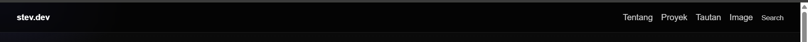
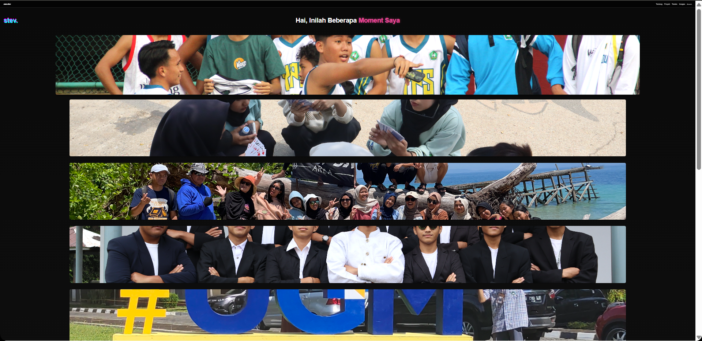
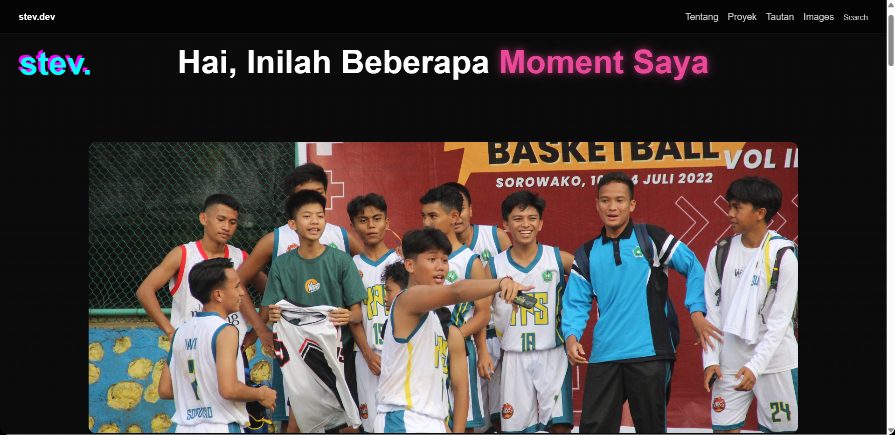

# CSS Navbar pada Portofolio Saya

<h3>CSS Navbar:</h3>

```css
.navbar {
  position: sticky; top: 0; z-index: 10;
  display: flex; justify-content: space-between; align-items: center;
  padding: 1rem 2rem;
  background: rgba(0,0,0,0.6); backdrop-filter: blur(8px);
  border-bottom: 1px solid rgba(255,255,255,0.1);
}
.navbar .logo { font-weight: bold; }
.nav-links { list-style: none; display: flex; gap: 1rem; }
.nav-links a, .nav-links button {
  color: #ccc; background: none; border: none; cursor: pointer;
  text-decoration: none;
  transition: color 0.3s;
}
```
<h4>Analisis:</h4>

```css
.navbar { position: sticky; top: 0; z-index: 10; }
```

- position: sticky: elemen bersifat seperti position: relative sampai kondisi scroll mencapai top: 0, lalu berubah menjadi fixed relatif ke scrolling container terdekat.

- top: 0: batas jarak atas ketika "menempel".

- z-index: 10: memastikannya berada di atas konten lain; nilai 10 biasanya cukup, tapi jika elemen lain punya z-index lebih besar perlu disesuaikan.

<br>

```css
.navbar { display: flex; justify-content: space-between; align-items: center; }
```

- display:flex: membuat layout baris fleksibel.
- justify-content: space-between: logo di kiri, nav elemen di kanan.
- align-items: center: vertikal center semua anak.

<br>

```css
.navbar { padding: 1rem 2rem; }
```

- memberi ruang dalam (vertical 1rem, horizontal 2rem). Perhatikan pada layar kecil ini bisa terasa besar

<br>

```css
.navbar { background: rgba(0,0,0,0.6); backdrop-filter: blur(8px); }
```

- background: rgba(0,0,0,0.6): latar semi-transparan gelap; membuat teks terang lebih kontras.
- backdrop-filter: blur(8px): blur apa yang berada di belakang elemen sehingga menciptakan efek frosted glass.
- Perlu vendor prefix: untuk Safari gunakan -webkit-backdrop-filter: blur(8px);.
- Performance: blur/filters mahal pada GPU; gunakan dengan hemat terutama untuk mobile.
- Efek hanya terlihat bila ada sesuatu di belakang (transparansi pada background wajib ada).

<br>

```css
.navbar { border-bottom: 1px solid rgba(255,255,255,0.1); }
```

- memberi garis tipis pemisah.

<br>

```css
.navbar .logo { font-weight: bold; }
```

- menebalkan teks logo

<br>

```css
.nav-links { list-style: none; display: flex; gap: 1rem; }
```

- list-style: none: menghilangkan bullet pada tag ul.
- display:flex: menata tag li secara horizontal.
- gap: 1rem: jarak antar item (modern & nyaman).

<br>

```css
.nav-links a, .nav-links button { color: #ccc; background: none; border: none; cursor: pointer; text-decoration: none; transition: color 0.3s; }
```

- Menyatukan style untuk link dan tombol: teks berwarna #ccc, tanpa background/border default.
- cursor: pointer: untuk memberi affordance klik — pada tag a sebenarnya default sudah pointer, tapi tidak masalah.
- transition: color 0.3s: transisi halus saat warna berubah (mis. hover). Default easing ease.
- Accessibility risk: menghilangkan border/background default tombol juga menghilangkan indikator fokus visual browser — harus ditambahkan kembali dengan :focus-visible agar keyboard users tahu fokus berada di mana.

<br>

<h4>Output:</h4>


<hr>

<h3>CSS Image:</h3>

```css
.foto img {
  width: 80%;
  height: 500px;
  object-fit: cover;
  border-radius: 12px;
  box-shadow: 0 4px 8px rgba(0,0,0,0.2);
  transition: transform 0.3s, box-shadow 0.3s;
  cursor: pointer;
}


.foto img:hover {
  transform: scale(1.05);
  box-shadow: 0 8px 16px rgba(0,0,0,0.3);
}
```

<h4>Analisis:</h4>

```css
.foto img {
  width: 80%;
```

- Menargetkan semua elemen tag img yang berada di dalam elemen dengan class foto.
- Gambar menyesuaikan 80% dari lebar container .foto.
- Artinya, jika container .foto lebarnya 1000px, maka gambar lebarnya 800px.

```css
height: 500px;
```
- Tinggi gambar dipaksa selalu 500px, berapapun ukurannya.
- Karena digabung dengan object-fit: cover, gambar tidak akan gepeng, melainkan dipotong (crop).

```css
object-fit: cover;
```
- Menentukan cara gambar menyesuaikan lebar dan tinggi.
- Dengan cover: gambar memenuhi area yang ditentukan, proporsinya terjaga, tetapi bagian yang kelebihan akan terpotong.
- Biasanya dipakai untuk tampilan galeri / card agar foto terlihat rapi.

```css
border-radius: 12px;
```
- Membuat sudut gambar membulat 12px → memberi efek modern & halus.

```css
box-shadow: 0 4px 8px rgba(0,0,0,0.2);
```
- Memberi bayangan lembut di bawah gambar:
- 0: tidak ada offset horizontal
- 4px: offset vertikal ke bawah
- 8px: blur radius
- rgba(0,0,0,0.2): warna hitam dengan transparansi 20%

```css
transition: transform 0.3s, box-shadow 0.3s;
```
- Menambahkan efek transisi yang halus selama 0.3 detik ketika gambar berubah ukuran (transform) atau bayangannya berubah (box-shadow).

```css
cursor: pointer;
```
- Saat kursor diarahkan ke gambar, ikon mouse berubah menjadi tangan (klik).
- Ini memberi isyarat kepada pengguna bahwa gambar bisa diklik (misalnya untuk diperbesar, membuka link, atau aksi lain).

```css
.foto img:hover {
  transform: scale(1.05);
  ```
- Saat di-hover, gambar membesar 5% dari ukuran aslinya.
- Dikombinasikan dengan transition, efeknya jadi mulus dan elegan (zoom halus).

```css
box-shadow: 0 8px 16px rgba(0,0,0,0.3);
```
- Bayangan bertambah:
- offset vertikal lebih besar (8px)
- blur lebih besar (16px)
- warna lebih pekat (30% transparansi).
- Efeknya: gambar terlihat seperti terangkat keluar dari layar.

<br>

<h4>Output:</h4>

- Output ketika di minimize menjadi 25%


- Output ketika di normalkan menjadi 100%

