# Mengerjakan Praktikum

<h3>Nomor 2 Bagian A<h3>

```html
<html>
    <head> 
        <title>Contoh JavaScript</title>
        <script language="JavaScript">
            document.write("Program JavaScript Aku di kepala");
        </script>
    </head>
    <body>
        <script language="JavaScript">
            document.write("Program JavaScript Aku di body");
        </script>
    </body>
    </html>
```

Analisis: Program JavaScript di atas akan menampilkan teks "Program JavaScript Aku di kepala" dan "Program JavaScript Aku di body" di halaman web. Yang artinya kita bisa menuliskan program JavaScript di dalam tag `<script>` di bagian kepala (head) atau tubuh (body) halaman web. <br>

Output:
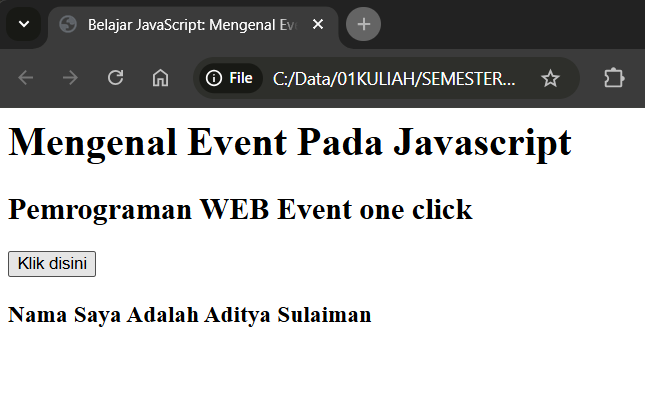
<hr>

<h3>Nomor 2 Bagian C<h3>

```html
<html>
    <head>
        <title>Belajar JavaScript: Mengenal Event Pada Javascript</title>
    </head>
<body>
    <h1>Mengenal Event Pada Javascript</h1>
    <h2> Pemrograman WEB Event one click</h2>
    <!--memberikan event pada element tombol-->
    <button onclick="tampilkan_nama()">Klik disini</button>

    <div id="hasil"></div>

    <script>
        function tampilkan_nama(){
            document.getElementById("hasil").innerHTML=
            "<h3>Nama Saya Adalah Aditya Sulaiman</h3>";
        }
        </script>
</body>
</html>
```

Analisis: Program JavaScript di atas akan menampilkan teks "Nama Saya Adalah Aditya Sulaiman" di halaman web ketika tombol "Klik disini" di klik. <br>

Output:

<hr>

<h3>Nomor 2 Bagian D<h3>

```html
<html>
    <head>
        <title> Contoh Sederhana JavaScript</title>
    </head>
    <body>
    <script language="JavaScript">
        document.write("Selamat Belajar Angkatan 2024","<br>");
        document.write("JavaScript Pemrograman WEB Teknik Komputer");
        </script>
    </body>
</html>
```

Analisis: Program JavaScript di atas akan menampilkan teks "Selamat Belajar Angkatan 2024" dan "JavaScript Pemrograman WEB Teknik Komputer" di halaman web. <br>

Output:
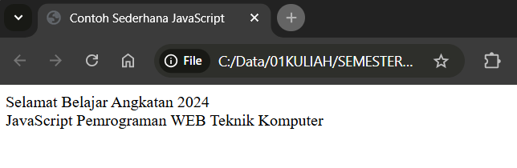
<hr>

<h3>Nomor 3<h3>

```html
<html>
    <head>
        <title>Masukkan Data</title>
    </head>
    <body>
        <script language="JavaScript">
            
                var nama = prompt("Siapa nama Anda?");
                document.write("Hai, " + nama);
                
    </script>
    </body>
</html>
```

Analisis: Program JavaScript di atas akan menampilkan dialog box yang meminta pengguna memasukkan nama. Setelah pengguna memasukkan nama, program akan menampilkan teks "Hai, [nama yang dimasukkan]" di halaman web. <br>

Output:
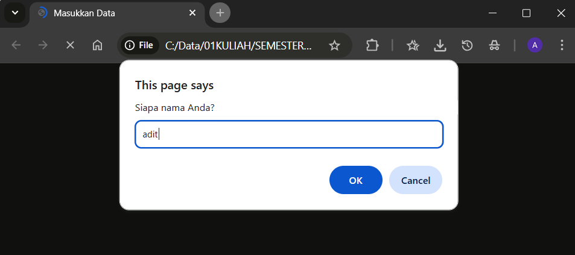

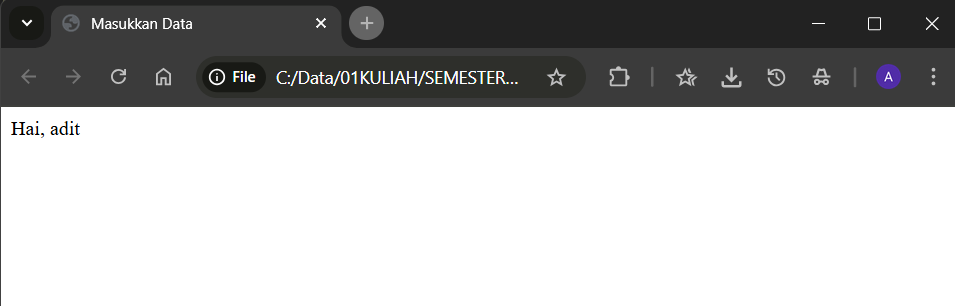
<hr>

<h3>Nomor 4<h3>

```html
<html>
    <head>
        <title>Konfirmasi</title>
    </head>
    <body>
        <script language="JavaScript">
                var jawaban=window.confirm(
                    "Apakah anda sudah yakin?");
                document.write("Jawaban Anda: "+ jawaban);
        </script>
    </body>
</html>
```

Analisis: Program JavaScript di atas akan menampilkan dialog box yang meminta pengguna mengonfirmasi apakah mereka yakin. Setelah pengguna mengonfirmasi, program akan menampilkan teks "Jawaban Anda: [true/false]" di halaman web. <br>

Output:
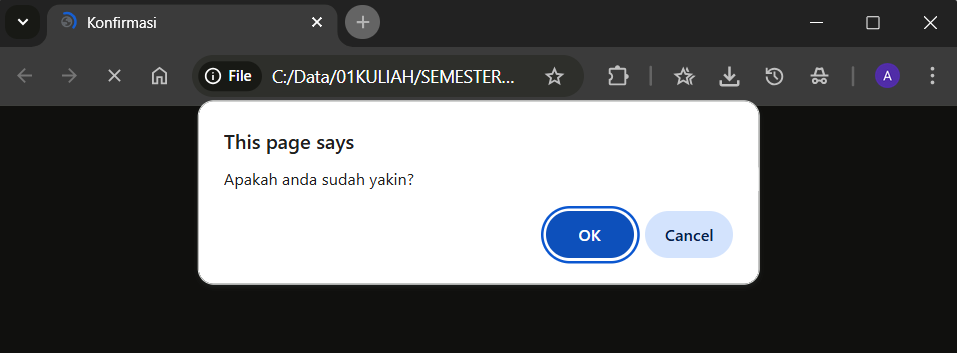
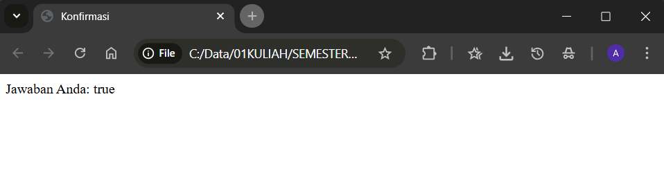
<hr>

<h3>Nomor 5 Bagian A<h3>

```html
<html>
    <head>
        <title>deklarasi variabel</title>
    </head>
    <body>
        <script language="JavaScript">
        
            var variabelku;
            var variabelku2=3;
            variabelku = 1234;
            document.write(variabelku*variabelku2);
            
            </script>
    </body>
</html>
```

Analisis: Program JavaScript di atas akan menampilkan teks "36928" di halaman web. Ini karena program mengalikan nilai variabelku (1234) dengan nilai variabelku2 (3) dan menuliskan hasilnya. <br>

Output:
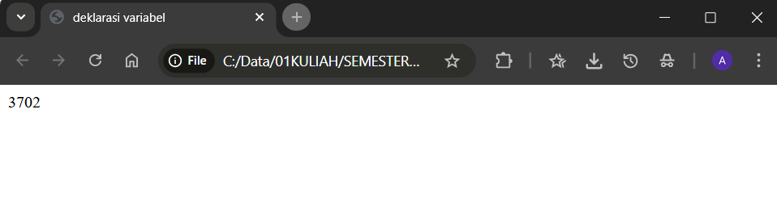
<hr>

<h3>Nomor 5 Bagian B<h3>

```html
<html>
    <head>
        <title>global dan lokal</title>
    </head>
    <body>
        <script lang="JavaScript">
           
                var a=12;
                var b=4;
                function perkalian_dengan2(b){
                    a=b*2;
                    return a;
                }
                document.write("Dua kali dari ",b," adalah ",perkalian_dengan2(b));
                document.write("Nilai dari a adalah ",a);
               
                </script>
    </body>
</html>
```


Analisis: Program JavaScript di atas akan menampilkan teks "Dua kali dari 4 adalah 8" dan "Nilai dari a adalah 8" di halaman web. <br>

Output:
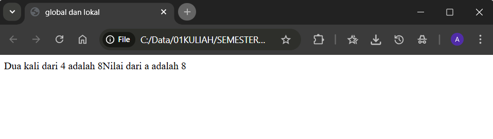
<hr>

```html
<html>
    <head>
        <title>global dan lokal</title>
    </head>
    <body>
        <script lang="JavaScript">
           
                var a = 12;
                var b = 4;
                function perkalian_dengan2(b) {
                    var a = b * 2;
                    return a;
                }
                document.write("Dua kali dari ",b,"adalah", perkalian_dengan2(b));
                document.write("Nilai dari a adalah ",a);
               
        </script>
        </body> 
        </html>
```

Analisis: Program JavaScript di atas akan menampilkan teks "Dua kali dari 4 adalah 8" dan "Nilai dari a adalah 12" di halaman web. <br>

Output:
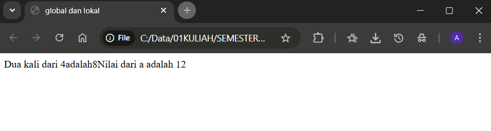
<hr>

<h3>Nomor 7<h3>

```html
<html>
    <head>
        <title>Konversi Bilangan</title>
    </head>
    <body>
        <script lang="JavaScript">
           
                var a = parseInt("27");
                document.write("1." + a + "<br>");

                a = parseInt("27.5");
                document.write("2." + a + "<br>");

                var a = parseInt("27A");
                document.write("3." + a + "<br>");

                a = parseInt("A27.5");
                document.write("4." + a + "<br>");

                var b = parseFloat("27");
                document.write("5." + b + "<br>");

                b = parseFloat("27.5");
                document.write("6." + b + "<br>");

                var b = parseFloat("27A");
                document.write("7." + b + "<br>");

                b = parseFloat("A27.5");
                document.write("8." + b + "<br>");
           
            </script>
    </body>
</html>
```

Analisis: Program JavaScript di atas akan menampilkan teks "1.27" "2.27" "3.27" "4.NaN" "5.27" "6.275" "7.27" "8.NaN" di halaman web karena parseInt() hanya mengonversi bagian integer dari string, sedangkan parseFloat() mengonversi bagian integer dan desimal dari string. <br>

Output:
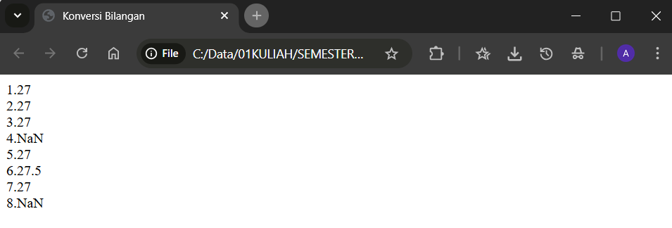
<hr>

<h3>Nomor 8<h3>

```html
<html>
    <head>
        <title>Operasi Matematika</title>
    </head>
    <body>
        <script lang="JavaScript">
           
                document.write("2 + 3 = " + (2 + 3));
                document.write("<br>");

                document.write("20 + 3 = " + (20 - 3));
                document.write("<br>");

                document.write("20 * 3 = " + (2 * 3));
                document.write("<br>");

                document.write("40 / 3 = " + (40 / 3));
                document.write("<br>");
                
        </script>
    </body>
</html>
```

Analisis: Program JavaScript di atas akan menampilkan teks "2 + 3 = 5" "20 + 3 = 17" "20 * 3 = 60" "40 / 3 = 13.333333333333334" di halaman web karena program melakukan operasi matematika sederhana seperti penjumlahan, pengurangan, perkalian, dan pembagian. <br>

Output:
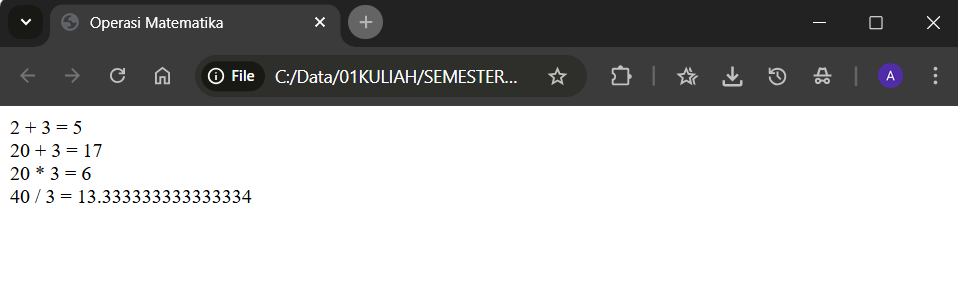
<hr>

<h3>Nomor 9<h3>

```html
<html>
    <head>
        <title>Operator?</title>
    </head>
    <body>
        <script lang="JavaScript">
            
                var nilai = prompt("Nilai (0-100): ", 0);
                var hasil = (nilai >= 60) ? "Lulus":"Tidak Lulus";
                document.write("Hasil: " + hasil);
                
        </script>
        </body> 
        </html>
```

Analisis: Program JavaScript di atas akan menampilkan teks "Nilai (0-100): " di halaman web. User diminta untuk memasukkan nilai antara 0 dan 100. Program akan menentukan apakah nilai tersebut lulus (diatas 60) atau tidak lulus (dibawah 60) dan menampilkan teks "Hasil: Lulus" atau "Hasil: Tidak Lulus" di halaman web. <br>

Output:
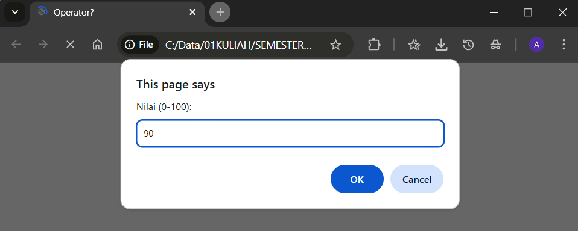
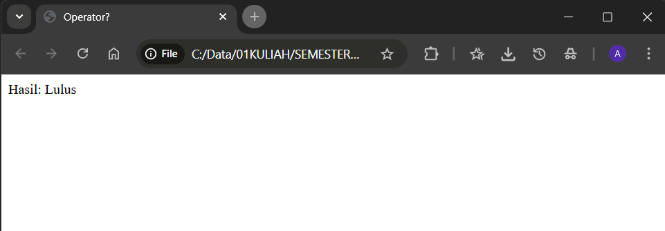
<hr>


# Mengerjakan Soal Tantangan
<h3>Soal Nomor 1<h3>
Buatlah Script Mengkonversi Tipe Data

```html
<html>
    <head>
        <title>Soal Script Mengkonversi Tipe data</title>
    </head>
    <body>
        <script lang="JavaScript">

                document.write("Mengubah bentuk string menjadi bilangan bulat parseInt()");
                document.write("<br>");

                a = parseInt("123.456 yang ditampilkan hanya bilangan bulat");
                document.write("1. " + a + "<br>");

                document.write("Mengubah bentuk string menjadi bilangan real parseFloat()");
                document.write("<br>");

                b = parseFloat("123.456 yang ditampilkan beserta angka dibelakang koma");
                document.write("2. " + b + "<br>");

                </script>
    </body>
</html>
```

Analisis: Program JavaScript di atas akan menampilkan teks "Mengubah bentuk string menjadi bilangan bulat parseInt()" "1. 123" "Mengubah bentuk string menjadi bilangan real parseFloat()" "2. 123.456" di halaman web. parseInt() akan mengonversi string menjadi bilangan bulat, sedangkan parseFloat() akan mengonversi string menjadi bilangan real (dengan desimal). <br>

Output:
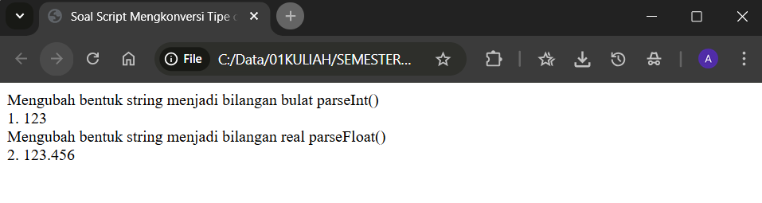
<hr>

<h3>Soal Nomor 2<h3>
Buatlah Script menggunakan Tipe data dalam Array. 

```html
<html>
    <head>
        <title>Menggunakan Tipe data dalam Array</title>
    </head>
    <body>
        <script lang="JavaScript">
            document.write("Menggunakan Tipe data dalam Array");
            document.write("<br>");
            var a = [1, "dua", true,];
            document.write(a[0]);
            document.write("<br>");
            document.write(a[1]);
            document.write("<br>");
            document.write(a[2]);
        </script>
    </body>
</html>
```

Analisis: Program JavaScript di atas akan menampilkan teks "Menggunakan Tipe data dalam Array" "1" "dua" "true" di halaman web. Array a memiliki tiga elemen, yaitu bilangan bulat 1, string "dua", dan boolean true. Program akan menampilkan elemen-elemen tersebut di halaman web. <br>

Output:
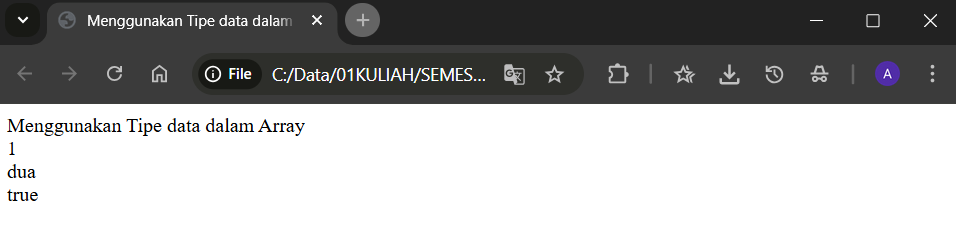
<hr>

<h3>Soal Nomor 3<h3>
Buatlah calculator sederhana pada menggunakan java script, menggunakan texfield 
dan tombol

```html
<html>
    <head>
        <title>Membuat kalkulator sederhana</title>
        <h1>Kalkulator Sederhana</h1>
    </head>
    <body>
        <script lang="JavaScript">
            document.write("Penjumlahan");
            document.write("<br>");
            var a = document.getElementById("txt1").value;
            var b = document.getElementById("txt2").value;
            var c = a + b;
            document.write(c);

            
        </script>
                <form>
            <input type="text" id="txt1">
            <input type="text" id="txt2">
            <input type="button" value="+" onclick="document.getElementById('txt3').value=parseInt(document.getElementById('txt1').value)+parseInt(document.getElementById('txt2').value);">
            <input type="text" id="txt3">
        </form>

    </body>
</html>
```

Analisis: Program JavaScript di atas akan menampilkan teks "Penjumlahan" di halaman web. User diminta untuk memasukkan dua angka di dalam dua textfield. Ketika user menekan tombol "+", program akan menambahkan kedua angka tersebut dan menampilkan hasilnya di textfield ketiga. <br>

Output:
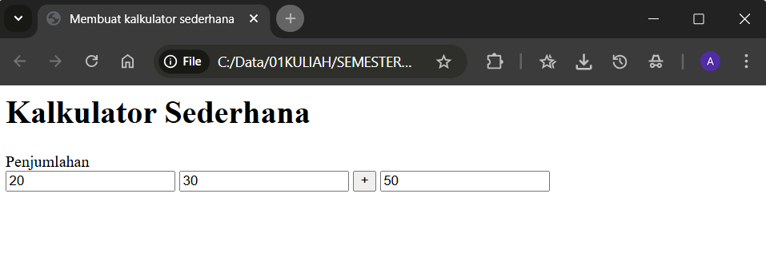
<hr>

<h3>Soal Nomor 4<h3>
Buatlah minimal 3 hitungan menggunakan java script menggunakan rumus bangun 
ruang.

```html
<html>
    <head>
        <title>Menghitung Menggunakan Rumus Bangun Ruang</title>
    </head>
    <body>
         <form>
            <input type="text" id="panjang" placeholder="Masukkan Panjang">
            <input type="text" id="lebar" placeholder="Masukkan Lebar">
            <input type="text" id="tinggi" placeholder="Masukkan Tinggi">
            <input type="text" id="sisi" placeholder="Masukkan Sisi">
            <input type="text" id="volume" placeholder="Volume">
            <input type="text" id="luas" placeholder="Luas">
            <input type="button" value="Hitung" onclick="hitung()">
         </form>
         <script lang="JavaScript">
            function hitung(){
                var p = document.getElementById("panjang").value;
                var l = document.getElementById("lebar").value;
                var t = document.getElementById("tinggi").value;
                var s = document.getElementById("sisi").value;
                var v = document.getElementById("volume").value;
                var a = document.getElementById("luas").value;
                if (p != "" && l != "" && t != ""){
                    v = p * l * t;
                    document.getElementById("volume").value = v;
                }
                if (p != "" && l != ""){
                    a = p * l;
                    document.getElementById("luas").value = a;
                }
                if (s != ""){
                    a = s * s;
                    document.getElementById("luas").value = a;
                }
            }
        </script>
    </body>
</html>
```

Analisis: Program JavaScript di atas akan menampilkan teks "Menghitung Menggunakan Rumus Bangun Ruang" di halaman web. User diminta untuk memasukkan panjang, lebar, tinggi, dan sisi bangun ruang di dalam textfield. Ketika user menekan tombol "Hitung", program akan menghitung volume dan luas bangun ruang sesuai dengan input user. Hasil volume dan luas akan ditampilkan di textfield "Volume" dan "Luas". fungsi if berguna untuk memeriksa apakah input user memiliki nilai. Jika iya, program akan menghitung volume dan luas bangun ruang sesuai dengan rumus yang sesuai. <br>

Output: <br>
P * L * T
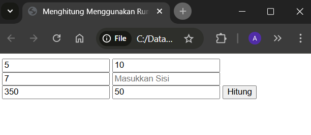
<br>

P * L
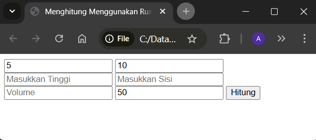
<br>

S * S
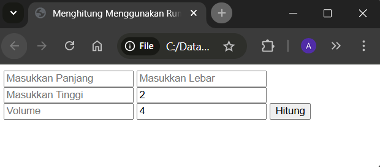
<hr>

#  Menambahkan JavaScript kedalam Portofolio

```html
<script lang="JavaScript">
      window.addEventListener('load', function () {
        alert("Selamat Datang di halaman Images");
      });
    </script>
```

Saya menambahkan JavaScript di dalam image.html untuk menampilkan alert saat halaman image.html dibuka, saya menambaahkan scriptnya pada bagian tag `<body>` yang berisikan pesan "Selamat Datang di halaman Image", Seperti pada gambar dibawah.


